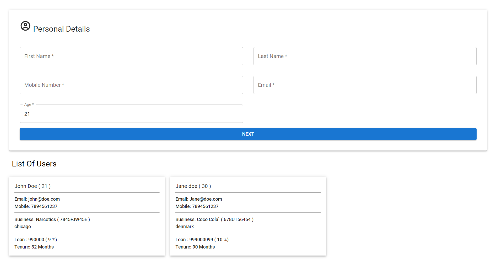

# dignify

## PREVIEW: https://dignify-client.vercel.app/

## For client

### clone the project, use cd/client, then use command npm install to install npm packages|

### npm start to start the server in localhost:3000

## For server

### clone the project, use cd/client, then use command npm install to install npm packages|

### npm start to start the server in localhost:8000
